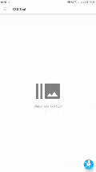

# 📱 TDE Mobile - Editor de TextDraws para SA-MP Mobile

> ⚠️ **Atenção:** Baixe a **release**, não o `.zip` do código!  
> 🔗 **[Download da Release](https://github.com/Brabosxtz/Tde-mobile/tags)**  
> 📅 **Última atualização:** 2024/03/23 16:55:37 BRT  

---

## 🚨 IMPORTANTE: Instalação do `TDE.txd`
> ❗ **Siga este passo para evitar erros e garantir que os botões apareçam no jogo!**  
>  
> 📁 **Local do arquivo para instalacao:**  
> `ru.unisamp_mobile.game/files/texdb/txd/txd.txt`  
>  
> 🔧 **Como instalar:**  
> 1. Escolha um dos arquivos `TDE.txd` da pasta **"TDE.txd (tipos)"**.  
> 2. Instale com o Txd Toll o arquivo(TDE.txd) existente no diretório acima.  

*(Repetir essa etapa é essencial para o funcionamento correto!)*  

---

## ✨ **ATRIBUTOS PRINCIPAIS**  

### 🔧 **Funcionalidades Gerais**  
- ✅ Suporte a **múltiplas linguagens**  
- ✅ Trabalhe em **cor de fundo** ou **ingame**  
- ✅ Importe textdraws de arquivos (por nome ou lista)  
- ✅ Defina nomes de variáveis (**globais** e **por player**)  
- ✅ Ajuste o **relógio ingame**  
- ✅ Redefina a posição do **HUD**  

### 🛠 **Edição Avançada**  
🎨 Altere cores facilmente (`/pickcolor`, `/rgbacreate`)  
🔄 **Desfaça alterações** ou **recupere textdraws excluídos**  
📐 Mova textdraws com **teclas** ou **analógico**  
🖼 **Sprite Browser** para visualizar sprites  
🚗 Ferramentas extras:  
- `/setskin` (Mudar skin)  
- `/veh` (Trazer veículos)
- `/commands` (Amostrar todos comandos)
- `/print` (Esconder o hud para uma print)
- `/mouse` (Ativar o modo de edicao)

### 🧩 **Gerenciamento em Grupo**  
👥 **Agrupe textdraws** para:  
- Mover múltiplos  
- Excluir em massa  
- Alterar cores simultaneamente  
- Alterar tamanho das textdraws agrupadas
- E muito mais
---

## 📸 **Preview**  
### 🖼️ Interface e Funcionalidades  
  
  

### ▶️ **Tutorial de Instalação**  
  

---

## ❓ **Precisa de Ajuda?**  
📌 **Problemas comuns:**  
- Certifique-se de que o `TDE.txd` está no local correto.  
- Verifique se a versão do SA-MP Mobile é compatível.  

🔍 **Dúvidas?** Abra uma **[issue](https://github.com/Brabosxtz/Tde-mobile/issues)** no GitHub!  
